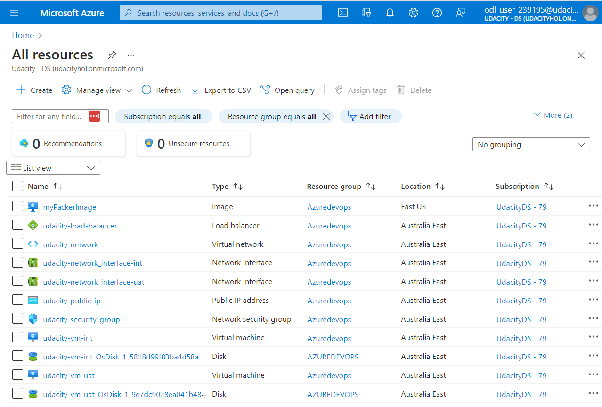

# Azure Infrastructure Operations Project: Deploying a scalable IaaS web server in Azure

### Introduction
For this project, you will write a Packer template and a Terraform template to deploy a customizable, scalable web server in Azure.

### Getting Started
1. Clone this repository

2. Create your infrastructure as code

3. Update this README to reflect how someone would use your code.

### Dependencies
1. Create an [Azure Account](https://portal.azure.com) 
2. Install the [Azure command line interface](https://docs.microsoft.com/en-us/cli/azure/install-azure-cli?view=azure-cli-latest)
3. Install [Packer](https://www.packer.io/downloads)
4. Install [Terraform](https://www.terraform.io/downloads.html)

### Instructions
We will need to:
1. Create an Packer image.
2. Create infrastructure with Terraform template.

#### Packer Image
Run command to create packer image
``` packer build server.json ```
#### Terraform Template
1. Implement code
  - Create a file ```main.tf``` to create
  - Create a file ```vars.tf``` to contain the variables
2. Initialize Terraform deployment
  - Run: ``` terraform init ``` to start
3. Terraform execution plan
  - Terraform plan command creates plan
  - Run: ```terraform plan -out solution.plan ```
  The -out parameter allows specifying of the output file and review of the plan
4. Apply a Terraform plan
  - Terraform apply command to execute plan to infrastructure
  - Run: ```terraform apply solution.plan```
#### How to customize vars.tf
Ex: If you want to deploy on other servers, you need to change values default in vars.tf file
```
  variable "server_names"{
  type = list
  default = ["<Server_1>","Server_2"]
}
```
### Output
Terraform will perform:


